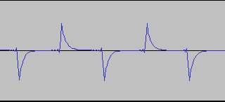
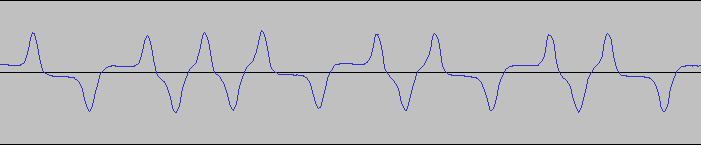
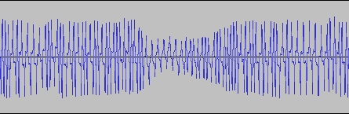
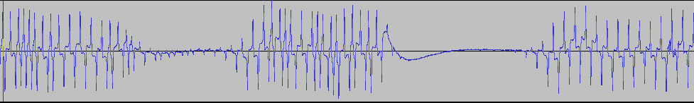
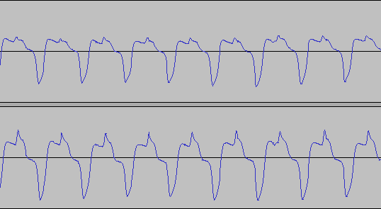

# TI-99/4a tape wave forms
Detailed information about the encoding and data format of the tapes can be
found [here](http://www.unige.ch/medecine/nouspikel/ti99/cassette.htm).

In short, bit are encoded using
[Biphase mark coding](https://en.wikipedia.org/wiki/Biphase_mark_code). The
resulting digital signal is then filtered by a high-pass filter before being
outputted.

# Wave form examples
Below I will give some practical examples of wave forms I encountered.

When recording directly form a TI-99/4A audio output the data wave form will
look as follows:

However when stored to tape the waveform will look more as follows:

The main cause of decoding problems are strong dips in the audio levels. Below
are two images showing such dips. The dips in the second image will certainly
cause bit errors.

The following image shows the wave form of a tape that is overall bad.
Especially the positive peaks of the first track are sometimes smaller than
the overshoot after the negative peaks. Luckily in this case however the second
track of the stereo recording is better.

Originally I was also worried about tapes being stretched, and thus prolonged
symbol lengths. But so far I haven't encountered this.
